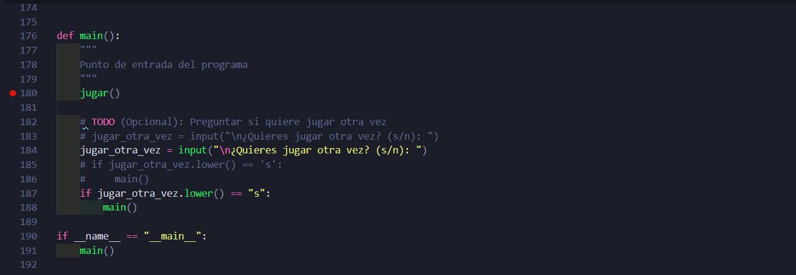
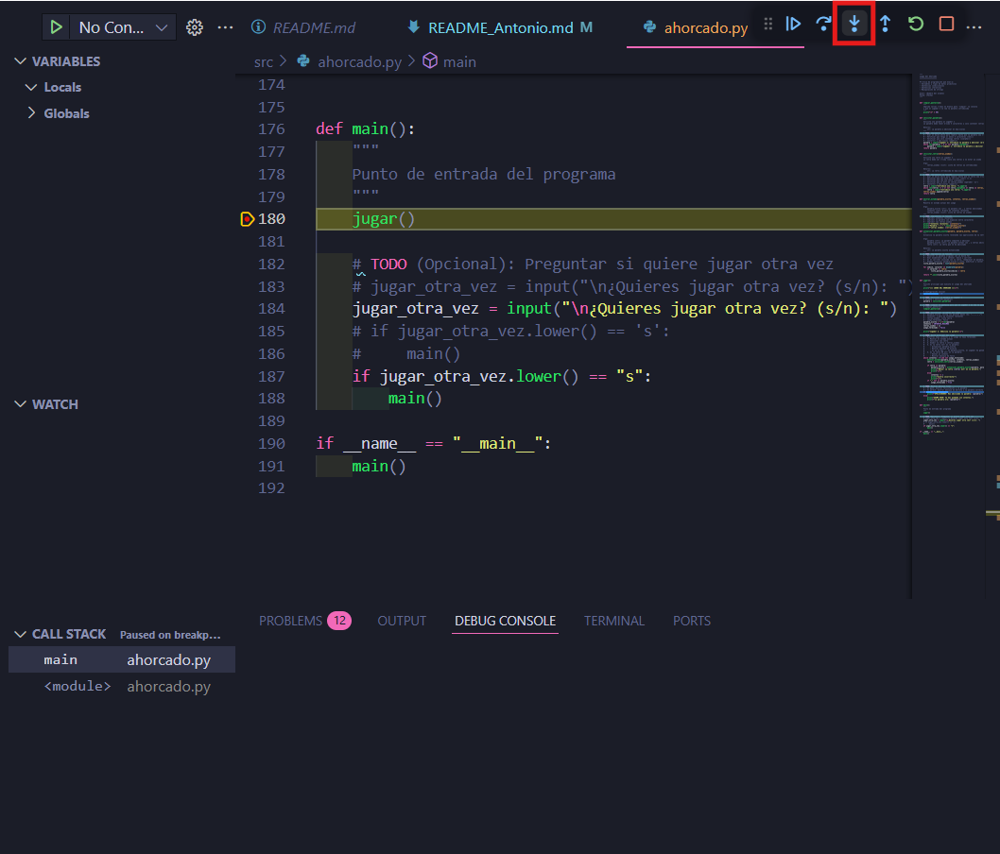
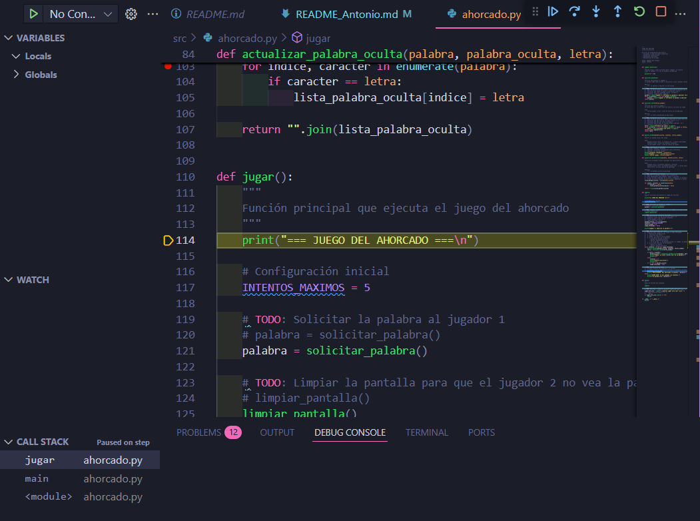
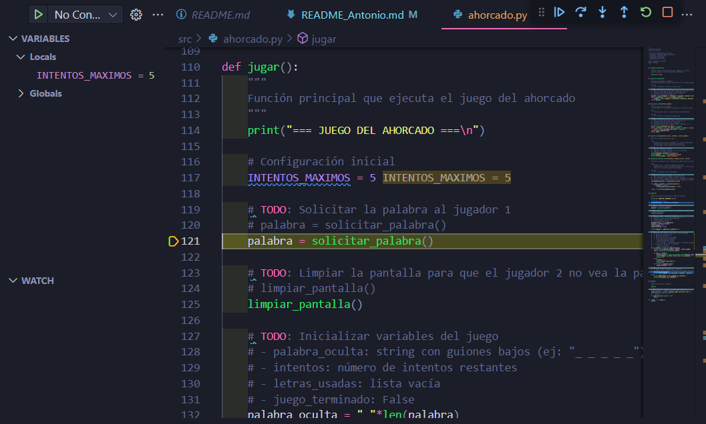
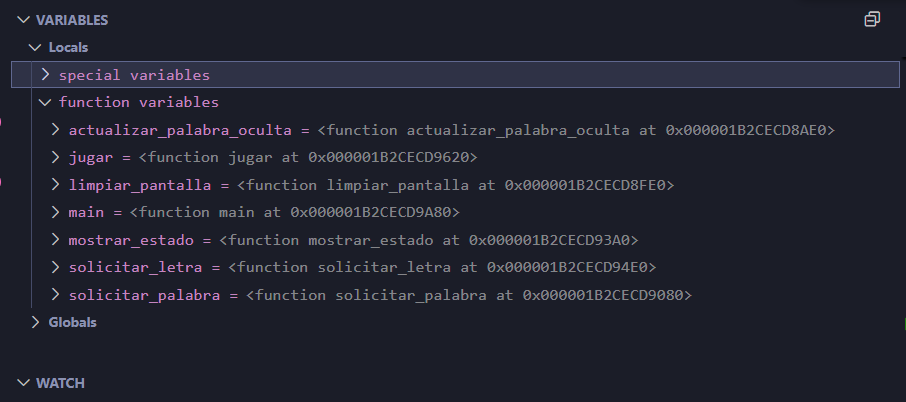

# Práctica juego del ahorcado

## Descripción:
Creación de aplicación para jugar al ahorcado entre dos personas, uno deberá escribir la palabra mientras otro la debe adivinar.
Se **gana el juego** si se adivina la palabra y se **pierde el juego** en caso de no adivinarla.

## Depuración del programa.
Para comprobar el programa pondremos un breakpoint en la funcion main() cuando llama a jugar()

Comenzamos a depurar el programa, mostrandonos lo siguiente. Además, para avanzar le deberemos dar  a lo que está señalado o al F11.

Cuando le demos al F11 o al botón, esta saltará a la función jugar, comenzando a hacer paso a paso lo que hay en esta. A la izquierda podremos ver los valores que van tomando las variables cuando se vaya avanzando con el f11.

Como podemos ver, ahora la variable **INTENTOS_MAXIMOS** tendrá valor 5, si le volvemos a dar al f11 veremos que nos llevará a otra función, pues la estamos llamando en la variable **palabra**

Otro ejemplo es si lo ponemos al principio, para ver el valor de todo:

## Documentación
He cambiado la documentación a docstrings en formato NumPy style, que es el más usado en entornos científicos, universidades y librerías.

[Ver codigo](src/ahorcado.py)